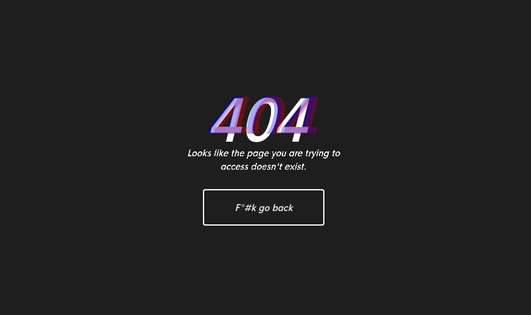

# [vmarches.in](https://vmarches.in)
My personal webpage and portfolio. Or something like that.

## Roast me!
You can reach me on any of the following websites:

**Facebook:** https://www.facebook.com/viniciusmarchesin<br/>
**Github:** https://github.com/vmarchesin<br/>
**Linkedin:** https://www.linkedin.com/in/vmarchesin/<br/>
**Medium:** https://medium.com/@vmarchesin<br/>
**Telegram:** https://telegram.me/vmarchesin<br/>
**Twitter:** https://twitter.com/devmarchesin

***

## What about the website?

[vmarches.in](https://vmarches.in) is created using React andWebpack. The whole website uses less than 1MB of bandwidth to load. It is served as a static page using [Netlify](https://www.netlify.com/), uses their Continuous Delivery system and is hosted for free. *I totally recommend checking them out, it's super simple to set everything up.*

To run locally:

```bash
git clone git@github.com:vmarchesin/vmarches.in.git
npm install
npm run dev
```

The app should start on `localhost:8080`.

***

## 404 Page

The 404 page isn't listed, but will be rendered if you land on an invalid route.



## LICENSE

This website is released under the [MIT LICENSE](https://github.com/vmarchesin/vmarches.in/blob/master/LICENSE), meaning you are free to modify and reuse any code for free or commercial use. If you do use something please be kind and reference the original author.